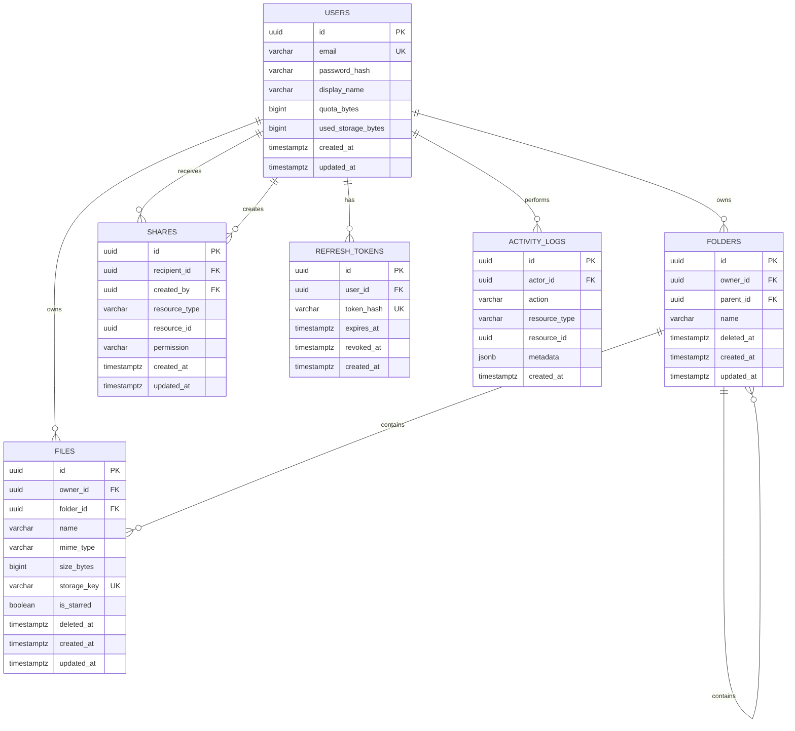

# Thiết kế Database — Cloud Storage

## 1. Nguyên tắc

- PostgreSQL chỉ lưu metadata và phân quyền; nội dung file nằm ở object storage (S3/R2/MinIO).
- Khóa chính dùng UUID để an toàn khi mở rộng nhiều service.
- Dùng `deleted_at` cho xoá mềm. Dữ liệu chỉ bị xoá object storage sau khi xoá vĩnh viễn.
- Mọi thời điểm được lưu UTC dưới dạng `TIMESTAMPTZ`.

## 2. ERD

`shares.resource_id` là khóa đa hình: tham chiếu đến `folders.id` hoặc `files.id` theo `resource_type`. Backend phải kiểm tra tính tồn tại và quyền sở hữu trước khi tạo share.

## 3. Định nghĩa bảng

### `users`

| Cột | Kiểu | Ràng buộc | Mô tả |
| --- | --- | --- | --- |
| id | UUID | PK, default `gen_random_uuid()` | Định danh người dùng |
| email | VARCHAR(320) | UNIQUE, NOT NULL | Email đăng nhập, lưu lowercase |
| password_hash | VARCHAR(255) | NOT NULL | Argon2/bcrypt hash |
| display_name | VARCHAR(100) | NOT NULL | Tên hiển thị |
| role | VARCHAR(20) | NOT NULL, default `user`, CHECK | Role hệ thống: `admin` hoặc `user` |
| avatar_url | TEXT | NULL | URL avatar tùy chọn |
| quota_bytes | BIGINT | NOT NULL, `> 0` | Tổng dung lượng được phép |
| used_storage_bytes | BIGINT | NOT NULL, `>= 0` | Dung lượng đang dùng |
| created_at, updated_at | TIMESTAMPTZ | NOT NULL | Audit timestamps |

### `folders`

| Cột | Kiểu | Ràng buộc | Mô tả |
| --- | --- | --- | --- |
| id | UUID | PK | Định danh thư mục |
| owner_id | UUID | FK `users`, NOT NULL | Chủ sở hữu |
| parent_id | UUID | FK `folders`, NULL | `NULL` là thư mục gốc |
| name | VARCHAR(255) | NOT NULL | Tên thư mục |
| deleted_at | TIMESTAMPTZ | NULL | Xoá mềm |
| created_at, updated_at | TIMESTAMPTZ | NOT NULL | Audit timestamps |

Unique index đề xuất: `(owner_id, parent_id, lower(name)) WHERE deleted_at IS NULL` để không trùng tên thư mục trong cùng vị trí.

### `files`

| Cột | Kiểu | Ràng buộc | Mô tả |
| --- | --- | --- | --- |
| id | UUID | PK | Định danh tệp |
| owner_id | UUID | FK `users`, NOT NULL | Chủ sở hữu |
| folder_id | UUID | FK `folders`, NULL | `NULL` là root |
| name | VARCHAR(255) | NOT NULL | Tên hiển thị |
| mime_type | VARCHAR(255) | NOT NULL | MIME type đã kiểm tra |
| size_bytes | BIGINT | NOT NULL, `>= 0` | Dung lượng file |
| storage_key | VARCHAR(1024) | UNIQUE, NOT NULL | Key object storage, không phải public URL |
| checksum | VARCHAR(128) | NULL | SHA-256, dùng kiểm tra integrity |
| is_starred | BOOLEAN | NOT NULL default false | Đánh dấu sao cá nhân của chủ sở hữu |
| deleted_at | TIMESTAMPTZ | NULL | Xoá mềm |
| created_at, updated_at | TIMESTAMPTZ | NOT NULL | Audit timestamps |

### `shares`

| Cột | Kiểu | Ràng buộc | Mô tả |
| --- | --- | --- | --- |
| id | UUID | PK | Định danh quyền chia sẻ |
| resource_type | VARCHAR(20) | `folder` / `file` | Loại tài nguyên |
| resource_id | UUID | NOT NULL | ID tài nguyên |
| recipient_id | UUID | FK `users`, NOT NULL | Người nhận |
| permission | VARCHAR(20) | `viewer` / `editor` | Quyền truy cập |
| created_by | UUID | FK `users`, NOT NULL | Người cấp quyền |
| created_at, updated_at | TIMESTAMPTZ | NOT NULL | Audit timestamps |

Unique index: `(resource_type, resource_id, recipient_id)`.

### `refresh_tokens` và `activity_logs`

- Refresh token chỉ lưu hash; token bị thu hồi có `revoked_at` khác `NULL`.
- Activity log là append-only, chứa hành động như `file.uploaded`, `folder.created`, `share.revoked`; `metadata` chỉ ghi dữ liệu không nhạy cảm.

## 4. Index và toàn vẹn dữ liệu

- `files(owner_id, folder_id, updated_at DESC) WHERE deleted_at IS NULL` cho My Drive.
- `files(owner_id, is_starred, updated_at DESC) WHERE deleted_at IS NULL` cho Starred.
- `files(owner_id, deleted_at DESC) WHERE deleted_at IS NOT NULL` và tương tự cho folders, phục vụ Trash.
- Full-text index GIN trên tên file/folder khi thêm Search.
- Dùng transaction để cập nhật `files` và `users.used_storage_bytes` cùng lúc.
- Không dùng cascade delete cho user/file trực tiếp; tác vụ nền xử lý xoá object storage sau retention policy.

## 5. Migration đề xuất

1. `001_users_and_refresh_tokens`.
2. `002_folders_and_files`.
3. `003_shares`.
4. `004_activity_logs_and_indexes`.
