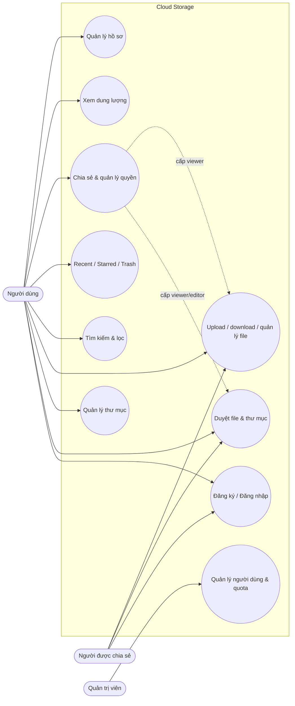
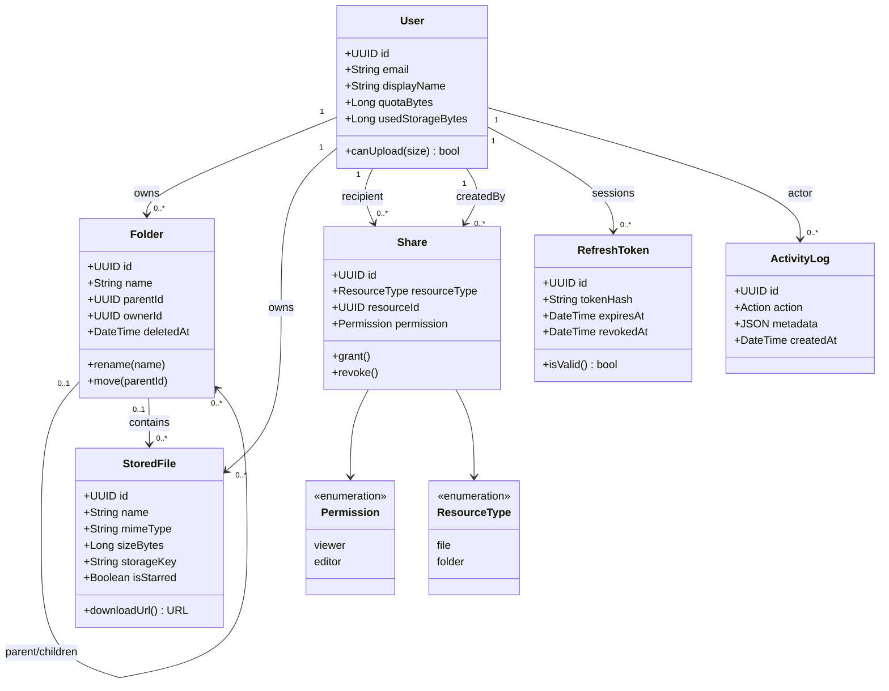
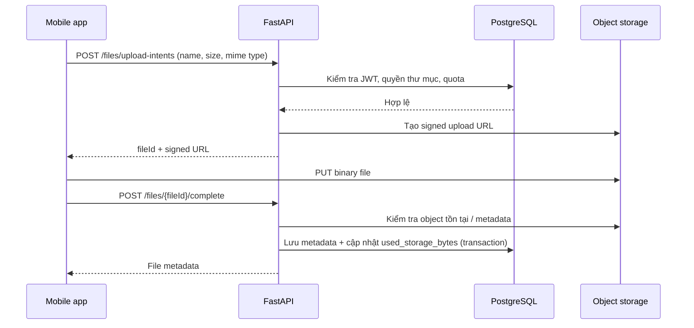

# Sơ đồ hệ thống Cloud Storage

## 1. Use case diagram

```mermaid
flowchart LR
    user([Người dùng])
    recipient([Người được chia sẻ])
    admin([Quản trị viên])

    subgraph cloud_storage[Cloud Storage]
      auth((Đăng ký / Đăng nhập))
      browse((Duyệt file & thư mục))
      folder((Quản lý thư mục))
      file((Upload / download / quản lý file))
      search((Tìm kiếm & lọc))
      starred((Recent / Starred / Trash))
      share((Chia sẻ & quản lý quyền))
      quota((Xem dung lượng))
      account((Quản lý hồ sơ))
      users((Quản lý người dùng & quota))
    end

    user --> auth
    user --> browse
    user --> folder
    user --> file
    user --> search
    user --> starred
    user --> share
    user --> quota
    user --> account
    recipient --> auth
    recipient --> browse
    recipient --> file
    admin --> users
    share -. cấp viewer/editor .-> browse
    share -. cấp viewer .-> file
```

## 2. Class diagram

```mermaid
classDiagram
    class User {
      +UUID id
      +String email
      +String displayName
      +Long quotaBytes
      +Long usedStorageBytes
      +canUpload(size) bool
    }
    class Folder {
      +UUID id
      +String name
      +UUID parentId
      +UUID ownerId
      +DateTime deletedAt
      +rename(name)
      +move(parentId)
    }
    class StoredFile {
      +UUID id
      +String name
      +String mimeType
      +Long sizeBytes
      +String storageKey
      +Boolean isStarred
      +downloadUrl() URL
    }
    class Share {
      +UUID id
      +ResourceType resourceType
      +UUID resourceId
      +Permission permission
      +grant()
      +revoke()
    }
    class RefreshToken {
      +UUID id
      +String tokenHash
      +DateTime expiresAt
      +DateTime revokedAt
      +isValid() bool
    }
    class ActivityLog {
      +UUID id
      +Action action
      +JSON metadata
      +DateTime createdAt
    }
    class Permission {
      <<enumeration>>
      viewer
      editor
    }
    class ResourceType {
      <<enumeration>>
      file
      folder
    }

    User "1" --> "0..*" Folder : owns
    User "1" --> "0..*" StoredFile : owns
    Folder "0..1" --> "0..*" Folder : parent/children
    Folder "0..1" --> "0..*" StoredFile : contains
    User "1" --> "0..*" Share : recipient
    User "1" --> "0..*" Share : createdBy
    User "1" --> "0..*" RefreshToken : sessions
    User "1" --> "0..*" ActivityLog : actor
    Share --> Permission
    Share --> ResourceType
```

## 3. Luồng upload (tham chiếu triển khai)

```mermaid
sequenceDiagram
    participant M as Mobile app
    participant A as FastAPI
    participant D as PostgreSQL
    participant S as Object storage

    M->>A: POST /files/upload-intents (name, size, mime type)
    A->>D: Kiểm tra JWT, quyền thư mục, quota
    D-->>A: Hợp lệ
    A->>S: Tạo signed upload URL
    A-->>M: fileId + signed URL
    M->>S: PUT binary file
    M->>A: POST /files/{fileId}/complete
    A->>S: Kiểm tra object tồn tại / metadata
    A->>D: Lưu metadata + cập nhật used_storage_bytes (transaction)
    A-->>M: File metadata
```
